<div align="center">

```text
                                                                                    
                                                     +         .          : .      .
    .           ::::::::::             .             .      .                .      
            ::::######**++....                                                      
.        :::;;;@%;;%%%###::,,,...   +    .   ####  ####    ###    ####  #####       
        ::;;;;;;=+=+*=-;;-::,,,...          #      #   #  #   #  #      #           
  :   ::-=;-@@-==++-;;--==-=-,,.,...         ###   ####   #####  #      ####   . .  
     :::;;;;;;;+++=;-;;:::::,,,...... *         #  #      #   #  #      #           
     :::;;;;;;;;;;;;;:::::,,,,,,. ...       ####   #      #   #   ####  #####       
    ::==-=;;;;;;;;;::::::,,,,,.,.  ..                                               
    ::==++=::;;;;---:::;:,,,,..,.  ..   +   =================================       
    ..--=---:::::::::;:,,,,....    ..       exploración espacial en ASCII           
     ..-;::;;::::,,,,,,,,....      ..       universo procedural infinito            
     ..;:,,,,,,,,,,,,,...,..      ..                                                
  .   ..,...............         ...    :                                 .         
 *      ............            ..            .   .        .      ^.                
         .....               ....                                 #                 
     *   : .......       .....                     .  .  :  .   / @ \               
.      .. .  :   .........                    .               */  =  \*       .     
                     .                      . .                   :                 
                   .        +          :                     .                 +    
```

**Un universo ASCII procedural donde cada sector esconde algo que todavía no has visto.**

*SPACE nace de una doble referencia: la tecla* `Espacio` *y el espacio exterior.*

</div>

&nbsp;

<p align="center">
  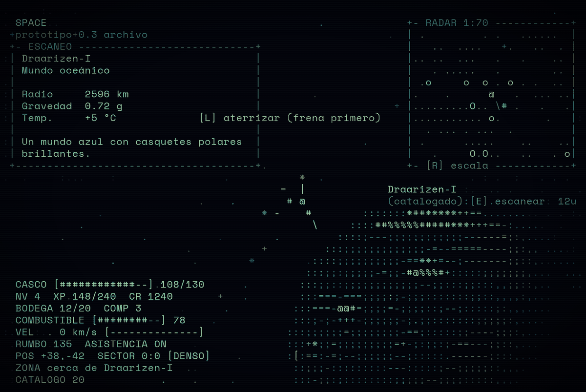
</p>

> Los planetas, naves, estaciones, señales y pantallas de este README **no están dibujados a mano**: se obtienen llamando a las funciones de dibujo
> del propio motor (`drawPlanet`, `drawShip`, `drawStationArt`, `drawSignal`...) y volcando lo que dibujan. Las capturas en color usan la
> tipografía real del juego, *Space Mono*. Lo que sí está hecho a mano: los diagramas de flujo, las ilustraciones de regiones y la portada
> (un planeta real del motor con estrellas y el título).

&nbsp;

```text
┌──────────────────────────────────────────────────────────────────────────┐
│  CONTENIDO                                                               │
│                                                                          │
│  01 // SOBRE EL JUEGO          08 // EL ARCHIVO: MAPA, CATÁLOGO, DIARIO  │
│  02 // EL UNIVERSO             09 // MISIONES Y REPUTACIÓN               │
│  03 // NAVES Y COMBATE         10 // CONTROLES                           │
│  04 // ESCANEAR Y DESCUBRIR    11 // PROGRESIÓN                          │
│  05 // ATERRIZAR Y EXTRAER     12 // EJECUTAR Y ESTRUCTURA               │
│  06 // ECONOMÍA Y ESTACIONES   13 // FILOSOFÍA VISUAL                    │
│  07 // TU BASE                 14 // ESTADO ACTUAL                       │
└──────────────────────────────────────────────────────────────────────────┘
```

&nbsp;

## `01 // SOBRE EL JUEGO`

**SPACE** es un juego de exploración espacial hecho con **HTML + CSS + JavaScript**, sin librerías ni imágenes.
Todo —planetas, naves, estaciones, el HUD, el radar, los paisajes de aterrizaje— se dibuja con **caracteres de texto** sobre una
cuadrícula, con la estética de una terminal retro.

Pilotas una nave por un universo infinito generado proceduralmente. Escaneas lo que encuentras, extraes recursos, comercias entre
estaciones, aceptas misiones, te defiendes de piratas, atraviesas regiones peligrosas y, cuando tienes recursos suficientes, levantas **tu propia base**.

Así es un fotograma real. Arriba a la izquierda, el panel de escaneo del objetivo; arriba a la derecha, el radar; abajo, el estado de la nave.
El planeta se dibuja como una esfera sombreada con una rampa de caracteres (`.:-=+*#%@`):

```text
  SPACE                                                         +- RADAR 1:70 ------------+
  prototipo 0.3 archivo                                         | .         . .   ......  |
 +- ESCANEO ----------------------------+                       |   ..  ....   +.   ..  . |
 | Draarizen-I                          |                       |.. ..  ...   .   .    .. |
 | Mundo oceánico                       |                       |   . .....   .        .. |
 |                                      |                       | .o     o  o . o . .  .. |
 | Radio     2596 km                    |                       |.    .      @   .  ... ..|
 | Gravedad  0.72 g                     |                       |.........O.. \# .   .   .|
 | Temp.     +5 °C             [L] aterrizar (frena primero)    |........... o.       .   |
 |                                      |                       |  . ... . ...  .         |
 | Un mundo azul con casquetes polares  |                       | .      .....    ..    ..|
 | brillantes.                          |                       |   .     O.O..   ..   . o|
 +--------------------------------------+                       +- [R] escala ------------+
                                               *
                                            =  |             Draarizen-I
                                             # @             (catalogado):[E].escanear  12u
                                         * -    #        :::::::*##*****++==.......
                                                 \     ::::##%%%%%#####***+++==-:....
                                                     ::::;---;;;;;;;;;;;;-----==;:,....
                                                   :::;;;;;;;;;;;;-=---=====---;;;:,, ...
                                                 ::::;;;;;;;;;;-==**+=----------;;::,......
                                                :::;;:;;;;;--;;=%@%%%#-::::;;;;;;;:,...  ...
  CASCO [############--] 109/130               :::;;:;;;;;;;;;;;;;--;;:::;;::::,;:::...   ..
  NV 4  XP 148/240  CR 1240                    :::+-=-===;;;;;;-;;;:::::::;:::,,,::,...
  BODEGA 12/20  COMP 3                        :::=-==@@*-;;;-=-:;;;::---;::::;;:,,,....
  COMBUSTIBLE [########--] 78                 :::;-;=++=-;;;;;;-;;;;:::::::;;;;;:,.....
  VEL    0 km/s [--------------]             :::-;;;;;=;;;;;;;-==-;.::::;-----;;::,....
  RUMBO 135  ASISTENCIA ON                   :::++;;=;;;;;;;;;=+-;:;;:-===---;;::,...
  POS +38,-42  SECTOR 0:0 [DENSO]            :[:==:-----;;;;;;-=;::::;-.-----;:::,...
  ZONA cerca de Draarizen-I                   ::-:;-::::::::;---:::::;--;;;;;:::,,.
  CATALOGO 20                                 :::-;::;::::::::;;;;;--;;;;::;::,,..
```

El ciclo de juego, dibujado a mano:

```text
        ┌────────────┐      ┌────────────┐      ┌────────────┐
        │  EXPLORAR  │ ───▶ │  ESCANEAR  │ ───▶ │ CATALOGAR  │
        │ vuela, mira│      │  [E] sobre │      │  planetas, │
        │ el radar   │      │ un objetivo│      │  señales   │
        └─────▲──────┘      └────────────┘      └─────┬──────┘
              │                                       │
              │                                       ▼
        ┌─────┴──────┐      ┌────────────┐      ┌────────────┐
        │ CONSTRUIR  │ ◀─── │  MEJORAR   │ ◀─── │  EXTRAER Y │
        │ tu base    │      │ nave, piezas│     │  COMERCIAR │
        │ y tecnología│     │  y armas   │      │ en estación│
        └────────────┘      └────────────┘      └────────────┘
```

&nbsp;

<table>
<tr>
<td width="50%">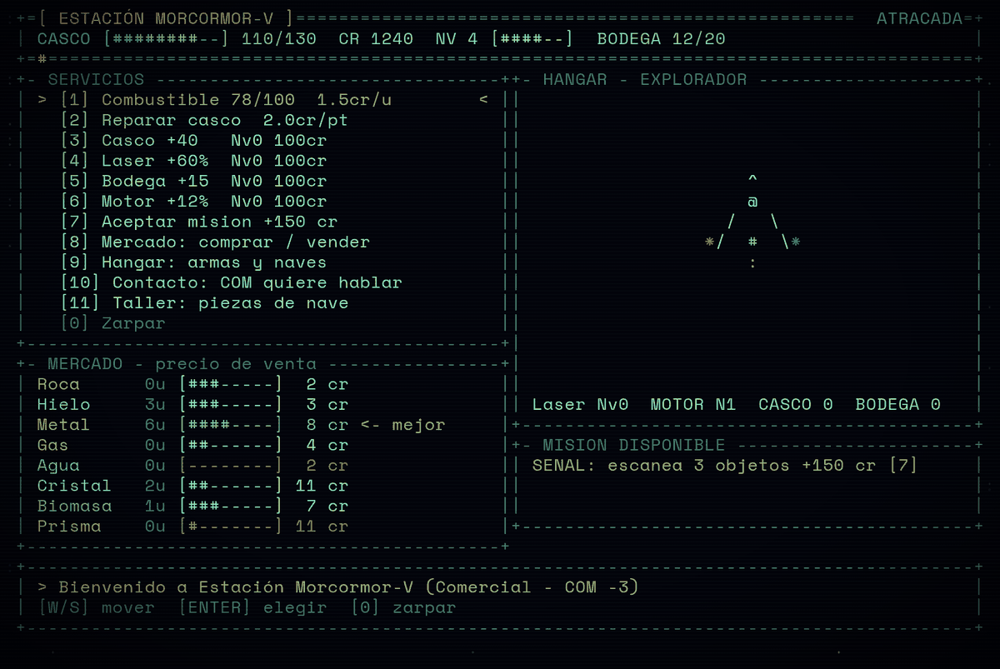<br><sub><b>El muelle</b> — servicios, mercado y hangar</sub></td>
<td width="50%">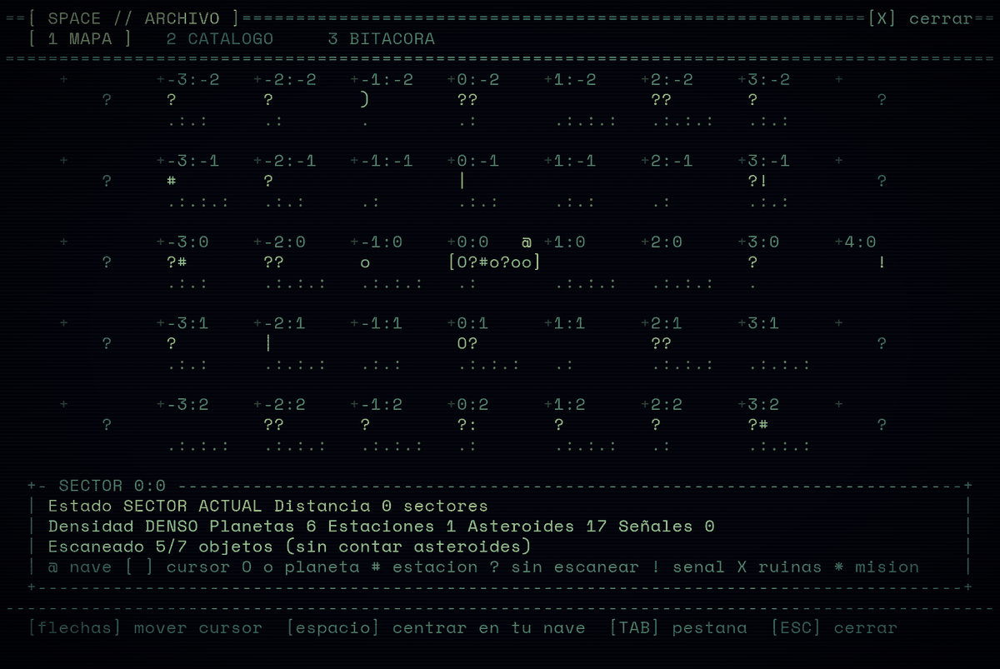<br><sub><b>El mapa</b> — niebla de guerra y densidad de cada sector</sub></td>
</tr>
<tr>
<td width="50%">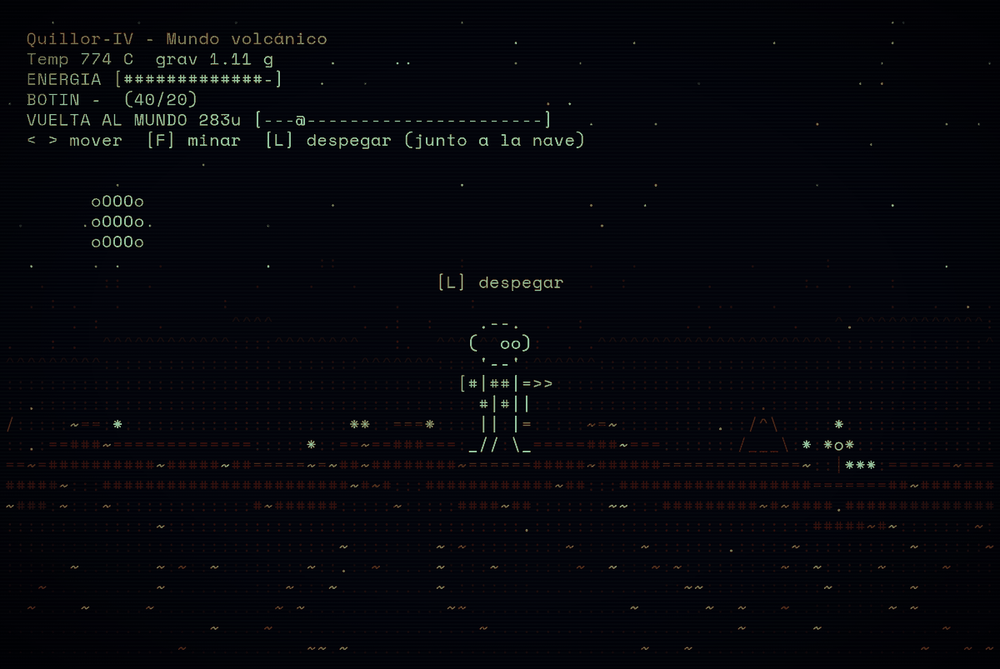<br><sub><b>Aterrizaje</b> — mundo volcánico</sub></td>
<td width="50%">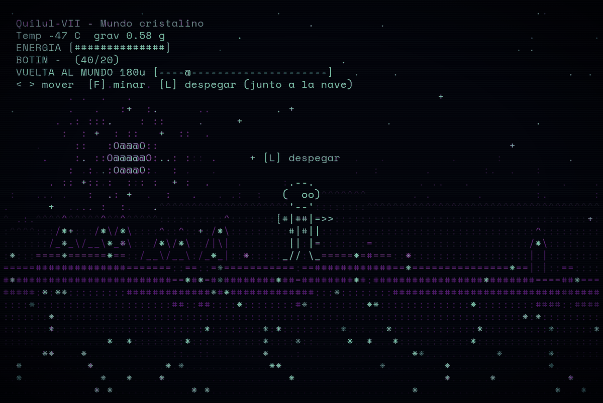<br><sub><b>Aterrizaje</b> — mundo cristalino</sub></td>
</tr>
<tr>
<td width="50%">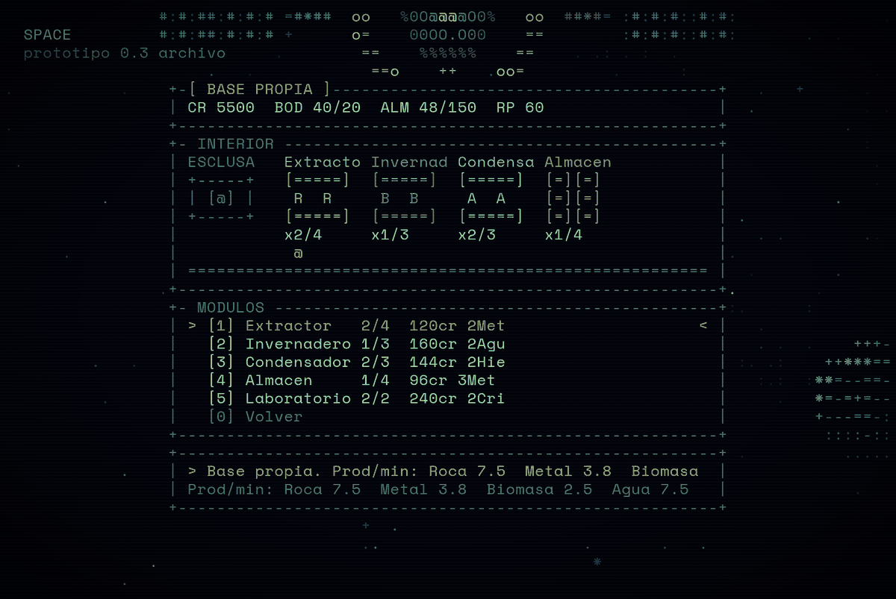<br><sub><b>Tu base</b> — módulos, almacén y tecnología</sub></td>
<td width="50%">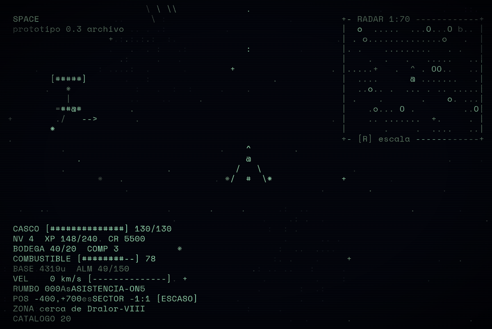<br><sub><b>Combate</b> — piratas, disparos y barras de vida</sub></td>
</tr>
</table>

&nbsp;

## `02 // EL UNIVERSO`

El espacio está dividido en **sectores** de 500 unidades. Cada sector se genera de forma **determinista** a partir de sus coordenadas:
nada se guarda del mundo, pero siempre es el mismo mundo. Viaja a un sector, vuelve mañana, y seguirá ahí.

Cada sector tiene una densidad —`VACÍO`, `ESCASO`, `NORMAL` o `DENSO`— que aparece en el HUD y en el mapa.
Un sector puede contener planetas, una estación, campos de asteroides y, a veces, una **señal** que no sabes qué es hasta que la escaneas.

### Planetas

Ocho tipos de mundo, cada uno con su propia textura, su gravedad, su temperatura y sus recursos. Esta es una muestra real del motor
(todos reescalados al mismo ancho; en el juego el gigante gaseoso es el más grande):

```text
MUNDO OCEÁNICO  ·  Bellor-IV                MUNDO SELVÁTICO  ·  Veur-II
recursos: Agua x2, Cristal, Roca            recursos: Biomasa x3, Agua

            ::::::::::                                  ::::::::::
        ::::######**++....                          ::::#-:::::--,:::.
     :::;;;@%;;%%%###::,,,...                    :::::::===========-;....
    ::;;;;;;=+=+*=-;;-::,,,...                  ::-:=========::::----;;:..
  ::-=;-@@-==++-;;--==-=-,,., ..              ::-+====::::===:--::-;;;;::...
 :::;;;;;;;+++=;-;;:::::,,,... ..            ::-========::====----;;;;,::,...
 :::;;;;;;;;;;;;;:::::,,,,,,.  ..            ::-=-=-:::::=====-----;;,.::,...
::==-=;;;;;;;;;::::::,,,,,.,.               ::;------=-=======----;;,...,.  ..
::==++=::;;;;---:::;:,,,,..,.               ..;;;-=-=+*=====-----;;:....
..--=---:::::::::;:,,,,....                 ..:;;;;;--=-----;;;;;;::...
 ..-;::;;::::,,,,,,,,....                    ..:;-;;;;;;;;;;;;;;:::,,..
 ..;:,,,,,,,,,,,,,...,..                     ..,,:;-;::::::;:::,,,,..
  ..,...............                          .. .,,,,,,:,,,,,,...
    ............                                ..     . ....
     ...                                         ...
        .

MUNDO ROCOSO  ·  Tosion-I                   MUNDO DESÉRTICO  ·  Aricor-I
recursos: Metal x2, Cristal, Roca           recursos: Metal x2, Cristal, Roca

          =;;==;---;                                  ----=--;:.
      **=--+-=--;;-;;:::                          :::::::;-==--:,...
    +*++=;=;==------;;:::,                      ;::::::,,:;===-;:,.,,.
  +==+++=+++++=--;==--;;:,.                   =--;;;;::::-==+=-;,,.,..
 ;=*=+-+*+=++==-:;;;;;;:::,                  ++===--;:::;;-===-;:,.....
 +++;++======--:;::;;:::,,.                  ++=+==--::,,:;-==-;:,....
-==--==--:---;::-;;:,,,,,..                 -+=+===-;;:,,:;==--;:,...
;:;------;;;;;----;:::,,.                   -+====-;:::,,:-==-;:,,..
:;:;;----;;;:-;;;;;:,,...                   -=====-;::,,,,:;-;;:,..
 ;;;;:-:-:-----;;;:::...                     -====-;::,,..,:;;::,.
 ,;:;;;-;:;-;;:::::,..                       ;;;;;;:,,,,,:::::,,.
  ,::;;;;;::,:,,,,..                          :,,,,,,..,,:::,,.
    .,:,,:,,.....                               .........,,,.
        ..                                         .....

MUNDO HELADO  ·  Zenvex-I                   MUNDO VOLCÁNICO  ·  Dradratos-VI
recursos: Hielo x2, Metal, Agua             recursos: Cristal x2, Metal, Roca

          +**##;**+=                                  *,,,,=,,..
      +###%%%###***+++=;                          *..#-,,,,,,;#,...+
    *#-%-###-##******++=-;                      ,,,,,,,#,,,,+=..=,..+.
  +*###%####****;***++==-;:.                  .,:,,,,,=,,,,,*=.....*..
 +****########;*+*+++==--;;,                 =,=,,%,,,,,,,,..........   =
 *+*****##--#**;+;++==-;;;.,.                ,%,,,,%,,,,,,,.........+   *
=++***#*******+++++=:-;;;:..                .,,,+,,#,,,,,,,.#+*,.....#  :
-:++*;***+++++++++:=--;:.,,.                ..,,,,;,,,,,,,,,*........   :
-==++++++;++:===:=-:;;::..                  .+.+,,,..,,.....:-*;..   ..+
 -====:==::=:=-,-,;;::,,                     ..;................    .   :
 ,;;---------;;;;::,,.                       #..*............       --: -
   ,::,;::;;:::,,,..                          :...:..;=-::
     .,,,,,.,...                                   :
                                                  ;         :.
                                                               +

GIGANTE GASEOSO  ·  Aricorion-V             MUNDO CRISTALINO  ·  Vevex-II
recursos: Gas x3, Cristal                   recursos: Prisma x2, Metal, Cristal

            ::::::::::                                ==++++=-;@
        ::::***+++====:::.                        -==--@::::*++@@,,:
     ::::---;;;;;;;:::::::...                   +;+++===========;;;:,,
    ::++****++++*+++++==---:..                @**--==-;+++;;:;;;=--@,:,
  ::;=+;;-=+====-;::::::,::,,,..             @**-----;;+++@:::;;;--%%#,.
 ::=;++===++=======---=+==--;, ..            -+==++****---;;;;@@@,,:,,*+
 ::-;--=***=-;:;;-------;:,,,,...           ;==;;@@@----+++==--;;;:::,.
::;;==--;;---=+-;;;;;--;;:,...  ..          =::;;+++====---==-;;:,,.,..
..-==-:::;--;;-;::::::::::::,.              -,,::====---;;;---:::.....
..,:;;:;::::::::,,::::,,,,..                 ::,,---;;;;;@%,,....,..   -
 ..,;----------;;:;;;;:,...                  ,::,,,::,,:::,::,,,..
 ..,:,,,,,,,,,,,,,,...                        .,,..,,,:,,,,,,...
  .. .,::::,,,,,......                          ..,,,,,.....
    ..    .......
     ..                                                        -
```

### Estaciones

Plataformas artificiales que sirven de puerto. Se dibujan con un núcleo central, un anillo que gira y módulos alrededor:

```text
                  ====                ====
                 =#OO#=              =#OO#=
                  ====- oooo ++ oooo -====
                      =o     ++     ==
#:#:##:#:#:#         ==    %0000%    ==         :#:#:#::#:#:
#:#:##:#:#:#        o=   %0OOOOOO0%   oo        :#:#:#::#:#:
#:#:##:#:#:#========oo+++%0O@@@@O0%+++oo========:#:#:#::#:#:
:#:#::#:#:#:        oo   %0OOOOOO0%   =o        #:#:#:##:#:#
:#:#::#:#:#:         ==    %0000%    ==         #:#:#:##:#:#
                      ==     ++     o=
                  ====- oooo ++ oooo -====
                 =#OO#=              =#OO#=
                  ====                ====
```

### Asteroides

Rocosos, helados y metálicos. Se pueden escanear y **romper a disparos** para recoger lo que sueltan:

```text
ROCOSO                      HELADO                      METÁLICO

     =::-                      *=--                        ==-::.
  ++##**+=:.                 ++*+-::.                    ##**=--:.
 =#*+=++=-:..               =+---=-:..                  -=**+-::...
:-=-:-==-:...               -:--::....                  -:----:...
:--::-=-.....                 ......                     ........
 :-:::.....
  .......
```

### Señales y misterios

Una señal es un punto `?` en el radar y en el espacio. No sabes qué es hasta que te acercas y la escaneas.
**No todo descubrimiento da recompensa**: algunas señales son una nave abandonada con carga, otras son una trampa pirata, y otras
simplemente no son nada. Sin escanear y tras escanear:

```text
señal sin identificar:   ?

sin escanear      tras escanear

?                   _/\_
                  <=[##]=>
                    \__/
```

Los once tipos de señal, tal como los dibuja el motor una vez identificados:

```text
Nave abandonada       Campo de restos       Baliza                Estación destruida

  _/\_                  ,     .             ( ! )                  #=#  #
<=[##]=>                         %.                                x#=#x
  \__/                %%    `                                     #=x#=##

                                  ,

Anomalía              Eco sin origen        Monolito              Camara antigua

 /\                   .                       .-.                   _/^\_
<&&>                                         |#|#|                 /_|=|_\
 \/                                          |#|#|                |__| |__|
                                             |#|#|
                                            _|___|_

Grieta                Señal desconocida     Nave fantasma

   \                  ) ? (                  _/\_
--(@)--                                     <_oo_>
   \                                        /____\
```

Los **monolitos** guardan *glifos de los Primeros*; las **cámaras** y las **grietas** también se registran. El inventario y la crónica llevan la cuenta
(`GLIFOS 2/5`, `CAMARAS 0`, `GRIETAS 0`).

### Regiones

Algunos sectores forman regiones con reglas propias. *(Ilustración hecha a mano; en el juego el efecto se ve como un tinte tenue de color,
partículas y una línea `REGION` en el HUD.)*

```text
NEBULOSA                    TORMENTA IÓNICA             VACÍO PROFUNDO
recarga gas, radar corto    descargas: -4 de casco      sin patrullas, silencio

    .:;;:.       .           ~~~~~~~~~~~~~~~~~~~                 .                  .
  .:;+**+;:.   :;;:.         ~~~~~~~~~~~~~~~~~~~
 :;+*####*+;::;+**+;:.              /                      .            ^
  ':;+**+;;:':;;;::'               /__                                  @                .
     '':::''    ''                   /                          .      / \    .
                                    /
                                   v
```

| Región | Efecto |
|---|---|
| **Nebulosa** | el gas recarga combustible, el radar pierde señales lejanas |
| **Tormenta iónica** | las descargas dañan el casco |
| **Vacío profundo** | sin patrullas; silencio total |

&nbsp;

## `03 // NAVES Y COMBATE`

La nave del jugador tiene tres estados de motor visibles: en reposo, con empuje (`:`) y con turbo (`*`). Las estelas dejan partículas tras de sí.

```text
reposo        empuje        turbo

    ^             ^             ^
    #             #             #
  / @ \         / @ \         / @ \
*/  =  \*     */  =  \*     */  =  \*
                  :             *
```

Hay tres naves. Comparten silueta, pero cambian color y estadísticas:

| Nave | Precio | Casco | Bodega | Motor |
|---|---:|---:|---:|---:|
| Explorador | — (inicial) | 0 | 0 | ×1 |
| Minero | 700 cr | -20 | +30 | ×0.92 |
| Caza | 900 cr | +50 | -8 | ×1.2 |

### Armas

Cinco armas. El **Láser** viene incluido; las demás se compran en el hangar de las estaciones:

| Arma | Precio | Daño | Cadencia | Vel. proyectil |
|---|---:|---:|---:|---:|
| Láser | — (incluida) | 1 | 0.24 s | 380 |
| Pulso | 350 cr | 0.45 | 0.1 s | 420 |
| Cañón | 600 cr | 3.2 | 0.7 s | 300 |
| Plasma | 1100 cr | 2.1 | 0.45 s | 330 |
| Riel | 1800 cr | 6 | 1.1 s | 720 |

### Enemigos

Los piratas aparecen más cuanto más te alejas del origen, y también si tu reputación con ellos es mala. Cada región trae los suyos
(*Dron salvaje* en la nebulosa, *Espectro* en la tormenta; reutilizan la silueta de otros enemigos). Las barras `[#####]` son su vida.
Siluetas reales del motor:

```text
Pirata            Aguijon           Acorazado         Francotirador     Jefe pirata

 | | ^ | |            ^                  ^                ^                      ^
 |   @   |            |              | | # | |            |                  | | | | |
   / # \              |              # # @ # #            |                    # # #
// = = = \\         / @ \           *# O # O #*         o | o                / # O # \
*         *       *   =   *          = = = = =            @                 /  O # O  \
                                                      * / = \ *         / /    # # #    \ \
                                                                        *    = = = = =    *
```

| Enemigo | Vida | Velocidad | Daño | Alcance | XP |
|---|---:|---:|---:|---:|---:|
| Pirata | ×1 | 70 | ×1 | 200 | 25 |
| Aguijon | ×0.5 | 115 | ×0.6 | 170 | 20 |
| Acorazado | ×2.4 | 42 | ×1.8 | 220 | 50 |
| Francotirador | ×0.8 | 60 | ×1.4 | 330 | 35 |
| Dron salvaje | ×0.4 | 95 | ×0.5 | 150 | 12 |
| Espectro | ×0.6 | 130 | ×1.2 | 180 | 40 |
| Jefe pirata | ×1 | 70 | ×1.3 | 230 | 60 |

Un combate real: arriba a la izquierda se ve a un enemigo con su barra de vida y proyectiles en el aire (`-->`).

```text
                                              .
  SPACE                                                         +- RADAR 1:70 ------------+
  prototipo 0.3 archivo                                         |  o  .....  ...O...O b.. |
                                              :                 | . o..............o   .  |
                                                                |. .    .........   . .   |
                                                                |    .  .   .   .....   ..|
                                                                |.....+   .  ^ . OO..   ..|
         [#####]                                                |  ....      @ .......   .|
            *                                                   |  ..o.. .  ... . .. .....|
            |                                                   | .    .       .    o. ...|
          =##@#                                                 |    .o... O .         ..O|
           /   -->                                              |    .. .......  +.     . |
         *                                                      |       .     .  ....   ..|
                                                                +- [R] escala ------------+
                                              ^
                                              @
                                            /   \
                                          */  #  \*


  CASCO [##############] 130/130
  NV 4  XP 148/240  CR 5500
  BODEGA 40/20  COMP 3
  COMBUSTIBLE [########--] 78
  BASE 4319u  ALM 49/150
  VEL    0 km/s [--------------]
  RUMBO 000AsASISTENCIA-ON5
  POS -400,+700esSECTOR -1:1 [ESCASO]
  ZONA cerca de Dralor-VIII
  CATALOGO 20
```

### Mejoras y piezas

En las estaciones puedes mejorar el casco, el láser, la bodega y el motor por niveles. El **Taller** vende piezas que se montan por ranura
(casco, arma, motor, sistema) y cuestan créditos y *componentes*:

| Ranura | Pieza | Efecto | Coste |
|---|---|---|---|
| casco | **Blindaje** | +30 casco | 250 cr + 2 comp. |
| casco | **Placas pesadas** | +60 casco, -10% motor | 450 cr + 4 comp. |
| arma | **Lente focal** | +25% daño | 350 cr + 3 comp. |
| arma | **Refrigerador** | -20% cadencia | 400 cr + 3 comp. |
| motor | **Inyectores** | +15% motor | 300 cr + 2 comp. |
| motor | **Eficiencia** | -35% combustible | 300 cr + 2 comp. |
| sistema | **Bodega ext.** | +20 bodega | 300 cr + 2 comp. |
| sistema | **Reactor** | repara 0.6 casco/s | 600 cr + 5 comp. |

&nbsp;

## `04 // ESCANEAR Y DESCUBRIR`

Mantén `E` sobre un objetivo cercano. El juego elige automáticamente el más cercano y, si hay una señal sin identificar, **le da prioridad** para
que los asteroides no la tapen. Al terminar, el objeto entra en tu **catálogo** y obtienes experiencia.

```text
   OBJETIVO          ESCANEO                  RESULTADO
  ┌─────────┐       ┌──────────────────┐     ┌────────────────────────────┐
  │  [ ? ]  │ ────▶ │ [E] ▓▓▓▓▓▓▓░░░░░ │ ──▶ │ PLANETA  → ficha y recursos │
  │  22 u   │       │ mantén pulsado    │     │ ESTACIÓN → mercado y misión │
  └─────────┘       └──────────────────┘     │ ASTEROIDE→ composición      │
                                             │ SEÑAL    → ¿botín? ¿trampa? │
                                             └────────────────────────────┘
```

Mientras escaneas se despliega la ficha del objeto, justo como en la portada. Mira el panel de arriba a la izquierda: radio, gravedad,
temperatura y una descripción.

&nbsp;

## `05 // ATERRIZAR Y EXTRAER`

Frena sobre un planeta y pulsa `L`. La cámara cambia a una vista lateral del terreno: caminas con `<` `>`, minas con `F` y vuelves a la nave para despegar.
Cada tipo de mundo tiene su propio paisaje, su cielo y sus recursos. Capturas reales del motor:

**Mundo oceánico** — agua, roca y cristal

```text
                     .                                                            ..
  Draarizen-I - Mundo oceánico                 .          .
  Temp 5 C  grav 0.72 g             .                                            .         .
  ENERGIA [##############]       .                                             . .
v BOTIN -  (40/20)                                             ^
  VUELTA AL MUNDO 264u [---@----------------------]   .     .           .              .  .
  < > mover  [F] minar  [L] despegar (junto a la nave)         .  . . .
                                            v                         . :: .
                                          .                . :   : +  : :+
                              .                            .     .   :   :  : ::  .
             v          .                                   :+  : :O@@@O: .  : :
    .                                                    .    : ::O@@@@@O: :      .
      :      .               ::         [L] despegar  .  .: :  ::::O@@@O:  :+:      .  .
.       :              .    .   .                     .  :   . : +  ::  ::::  .   :  .
      ..            :               .      :.--.           .    .::..  +   .   .  .  ..    .
    :. .              .          . .:  :   (  oo) .  :         ..:   : : .        :.       :
^^^^^. .:  .: .*  *.  ^^^^^^^^^.    :.      '--'.:  . ^^^^^^^^^^^^^^^^^^^^^^^^^^ . .     ^^^
:::::^^^^^^^^^^[#[#]^^:::\:|:/:^^^^^^^^^^^[#|##|=>>^^^::::::::::::::::::::::::::^^^^^^^^^:::
:::::::::::::::|#|#|::::::\|/:::::::::::::::#|#||::::::::::::::::::::::::::\:|:/:::::::::::\
o:.::::Y:Y:::::|#|#|:::::::|::::::::::::::::||:|=::::::::Y:Y::::::::::::::::\|/:::::::::::::
========Y::::::|#|#|::::*::|::::::::=::::::_//:\_:::::::::Y====:*:::::.:*:.::|::::::::::::::
########==::::[#[###]=========::::==#======##====::========####=====*:::====:|::::::::::*:::
##########=========###########====###############==#################====####================
::::::::############################:######::##############::::#############################
::::::::::#########:::::::::::####:::::::::::::::##:::::::::::::::::####::::################
::::::::::::::::::::::::::::::::::::::::::::::::::::::::::::::::::::::::::::::::::::::::::::
::::::::::::::::::::::::::::::::::::::::::::::::::::::::::::::::::::::::::::::::::::::::::::
........::::::::::::::::::::::::::::.::::::..::::::::::::::....:::::::::::::::::::::::::::::
..........:::::::::...........::::...............::.................::::....::::::::::::::::
............................................................................................
............................................................................................
............................................................................................
```

**Mundo volcánico** — cristal, metal y roca

```text
    .       .        .                    .                                       ..
  Quillor-IV - Mundo volcánico                 .          .            .          .
  Temp 774 C  grav 1.11 g     .     ..         .     .                           .         .
  ENERGIA [#############-]   .   .                .             .              . .
. BOTIN -  (40/20)                                  .                      .
  VUELTA AL MUNDO 283u [---@----------------------]   .     .                          .  .
  < > mover  [F] minar  [L] despegar (junto a la nave)                          .
                  .                                         .
          .                               .           .                    .
        oOOOo                 .                        .   .                      .
 .     .oOOOo.          .
        oOOOo
  .     . .   .         .    ::           :           .   .          .      :          .
   .     ::  .         .    .   .                     .  :       .        :.  .   :      .
  . : .   .         :               .      :                    . ..   .      .   .   .    .
      . :     .      ^^^^        . .:  :   ..--.  .  :         . .       .   ^^^^^^^^^^^^^^:
.   : .  ^^^^^^^^^^^^::::^^^^^^^^   :.  ^^^(^^oo):  . .^^^^^^^^^^^^^^^^^^^^^^::::::::::::::^
^^^^^^^^^::::::::::::::::::::::::^^^^^^^::::'--':^^^^^^:::::::::::::::::::::::::::::::::::::
::.:::::::::::::::::::::::::::::::::::::::[#|##|=>>:::::::::::::::::::::::::::::::::::::::::
::::::::::::::::::::::::::::::::::::::::::::#|#||:::::::::::::::::.:::.:::::::::::::::::::::
/:.:::~==:*:::::::::::::::::::::**::===*::::||:|=:::::~=~::::::::::::/^\:::::*::::::::::::::
::::==###~=============:::::*::==~==###===:_//:\_=====###~===:::::::/___\:*:*o*:::::::::::::
==~=##########~#####~##=====~=~##~########~======#####~######=============~::|***:======~===
#####~:::#######################~#~#:::############~##:::##################==.====##~#######
~###:~:::~:::::::::::::#~######:::::~:::::####~#.:::::::~~:::#########~#~###################
::::::::::::::~::::::::::::::::::::::::::::::::::::::::::::::::::::.:::::::#####~#~:::::::~:
:::::::::::::::::::::::::::::::.::::::::~:~:::::::::~::::::~:::::::::::::~::::::::::~::::::~
::::::~..:::::~:~::~::::::::~:::::~:...:~::::~:::::::~..~:::~:~:::::::::~::~:::::~:::::~::::
:::~..........~........:::~:::~.........~.:::::::............::~~:::::::::::~:::::::~:::::::
..~....~.....~...........~.~.............~~...............~......~..~...~..:::::::~.~.......
...................~....~...................~.......................~......~...........~....
................~...........~~.~...........................~...~.....................~...~.~
```

**Mundo selvático** — biomasa y agua

```text
       .             .                    .                                       ..
  Ionka-VIII - Mundo selvático                 .          .
  Temp.27 C  grav 0.85 g            ..                                           .         .
  ENERGIA [##############]       .                                             . .
  BOTIN -  (40/20)                                  .
  VUELTA AL MUNDO 228u [---@----------------------]   .     .                          .  .
 .< > mover  [F] minar  [L] despegar (junto a la nave)

                                          .                           . .
                              .                            .     .    +       ..  .
    .  .                .                                          :::  : .  + :
  *                                                           . :  .  :  : :     .: .
           .            .    ::           :           .  .. .  ::    .:O@@@O::&&&&&&&  .
       ..              .    .   .           *         .  :   . : +  ::O@@@@@O&&&&*&&&&&
            :  &&&&&&&              .      :.--.           .    .::.  :O@@@O&*&o&&&&&o&&   .
   .  .       &&&&*&&&&&         .^^^^^^^^^(  oo) .  :         .::   : : :: &&&&&&&&&&&&&. :
 :..: .    . &&&o&&&&&o&&  .^^^^^^:::::::::^'--'^^^^^ .   &&& .     :.+ :  : &&&&&|&&&&&   .
^^^^^^^^^^^^^&&&&&&&*&&&&&^^::::::::::::::[#|##|=>>::^^^^&&*&&^^^^^^^^^^^^^^^^&&&|||^^^^^^&&
::::::::::::::&&&&&|&&&&&::::*::::::::::::::#|#||:::::::::&&&:::::::*:,:::::::_oo|||:::::::&
:::::::::*::::::::|||:::::::::::::::::::::::||:|=::::::::::|:::::::""""""""":::|||||::::::::
::::::::::::::::::|||:::::::::::::::::*:"""_//,\_":::::::":|::":"""#########"""""""",,::::*:
""""*::,"":::":,,:|||":::::":""::*:::"""""""""""""":,:::""""""""####################"",:""""
####"""""":""""""""""""::"""""""""""""############""""""###########:::::::::##########""####
##########"############""#######################################::::::::::::::::::::########
::::##################################::::::::::::######::::::::::::::::::::::::::::::##::::
::::::::::#::::::::::::##:::::::::::::::::::::::::::::::::::::::::::::::::::::::::::::::::::
:::::::::::::::::::::::::::::::::::::::::::::::::::::::::::::::::::.........::::::::::::::::
::::::::::::::::::::::::::::::::::::::::::::::::::::::::::::::::....................::::::::
....::::::::::::::::::::::::::::::::::............::::::..............................::....
..........:............::...................................................................
............................................................................................
............................................................................................
```

**Mundo cristalino** — prisma, cristal y metal

```text
 .                   .                                                            ..
  Quilul-VII - Mundo cristalino                .          .
  Temp -47 C  grav 0.58 g           .                                            .         .
  ENERGIA [#############-]       .                                             . .
  BOTIN -  (40/20)                                  .
  VUELTA AL MUNDO 180u [----@---------------------]   .     .                          .  .
  < > mover  [F] minar. [L] despegar (junto a la nave)             +
          . .  .   .
 .        .   .  .:  +:       ..          . +
        . .. :::     : ::.    .                            .                      .
         .  : :+ : ::   :  :: :.
     .     ::   ::O@@@O: +
      .    ::.  :O@@@@@O: . ::: .     +   :           .   .          .      : +        .
            . .. :O@@@O:  ::.   .                     .  :       .        :.  .   :
       . .: +::.:  ::: :    :  .    .      :.--.                . ..   .          .   .    .
 :   ... .   :  .: :++.  : + . . . .:  :   (  oo)^^^^^^^       . .       .        :.       :
.      +  .... .  :.   .^^^^^^^^^^^^^^^^^^^^'--'::::::::^^^^^^^^^^^^^^^^^^^^^^^^^^^^^^^^^^^^
^ .:.^^^^^^^^^^^^^^^^^^^::::::::::^:::::::[#|##|=>>:::::::::::::::::::::::::::::::::::::::+:
:^^^^:::/*+:::/*\/*\::::^::^::::/*\::::+::::#|#||:::::::::::::::::::::::::::::::::^:::::::::
:::::::/_*_\/__\*_*\:::/*\/*\:+/|\|:::::::::||:|=:::::::=::::::::::::::::::::::::/*\::::::::
:*:::====*======*==::/__\/__\:/_*_|::*:::::_//:\_=====*=#===::*::::::::::::::::::|:|::::::::
=====##############=======::==::=*===========:==############==*===============*==|:|::==::::
#*########################==*#*=#*########*##=########*#:#################*#######====##*===
#####:*:**:::::::::#############*#*#############:::*::::::::################################
::::*:::::::::::::::::::::##::##::::*::::::::#*:::::::::**::::::::::::::*:::::::::####::####
:::::::*::::::::::::::::::::::::::::::::::::::::::::::::::::::::::::::::::::::::*:*:::::::::
:::::::*:::::::::::::::::::::::*::::::::*:*:::::::::*:::.::*:::::::::::::*::::::::::*::::::*
:::::...........*..*::::::::*:::::::::::*::::*::.....*..*...*:::::::::::*:::::::::::::::::::
......**....*.............::..::........*....:.................**...........*.....::*:..::::
..*..........*...........*.*.............**...............*.........*...............*.......
..*............*...*....*...................*.......................*......*...........*....
..............*.*............*.*...............................*.....................*...*..
```

Si prefieres no aterrizar, también puedes minar asteroides disparándoles desde la nave; lo que sueltan flota hasta que lo recoges:

```text
               ..                   :                                         .
  SPACE                     .   .                               +- RADAR 1:70 ------------+
  prototipo 0.3 archivo                                         |   oo ..........O.. b# . |
                                   :        :     .             | ...  ............ o.    |
 .    :         .                                               |        .. ... . ...  .  |:
     . :    .:                                                  | ..  .         .O...    .|
                 .                      :                 .     |..... .   .      .O..    |
                                                                |   ... .    @... . .. .. |
      :       :                             .                   |.  ..o   .  .\... ..o....|
   :            .                                            .  |  .  ....             ...|
         .                        .                 .:          |      o...O. ..  .       |
     ::                                                .        |     .  .... ..         .|
                          :                 .       :           |.       .    .  o....  . |
                       :   .              .    *         .  :   +- [R] escala ------------+
                  :      .               ::    |              .
              .        .:     .             =  |      :
                      .                      # @ :     .                               .
                :     . .                 */ /  # \                                    :
                                   .                                            :
             .               :
                              :       :               :
  CASCO [##############]:130/130                          :        .         *  :
 .NV 4 :XP 148/240  CR 5500                                     Asteroide UU-115    .
  BODEGA 40/20  COMP 3   :         .           :                [E] escanear  27u
  COMBUSTIBLE [########--] 79      .                    .       :   -=++-::     .    .
  BASE 4397u  ALM 50/150                                           -=.--==-:.
. REGION Nebulosa                    .            :          *     +=-:==:....          .
  VEL    0 km/s [--------------]                      .         [  =+++=*....  ]      .
  RUMBO 128  ASISTENCIA ON                     .                    ..:.....          .
 :POS -453,+758 .SECTOR -1:2 [DENSO]                                   .
  ZONA espacio profundo          :                        .    .        :
  CATALOGO 20     :                               +                          .
```

&nbsp;

## `06 // ECONOMÍA Y ESTACIONES`

Ocho mercancías con precio base. Cada estación tiene un **perfil** que decide qué vende barato y qué paga bien; sus precios además cambian con
la saturación del mercado y con eventos.

| Mercancía | Precio base |
|---|---:|
| Roca | 2 cr |
| Hielo | 3 cr |
| Metal | 6 cr |
| Gas | 5 cr |
| Agua | 4 cr |
| Cristal | 12 cr |
| Biomasa | 7 cr |
| Prisma | 15 cr |

| Perfil de estación | Vende barato | Paga bien | Facción |
|---|---|---|---|
| Minera | Roca, Metal, Hielo | Biomasa, Cristal | Comerciantes |
| Comercial | Agua, Gas | Metal, Roca | Comerciantes |
| Científica | Cristal, Prisma | Gas, Biomasa | Exploradores |
| Colonia | Biomasa, Agua | Hielo, Metal | Federación |
| Guarida | Metal, Cristal, Hielo | Agua, Biomasa | Piratas |

Así se ve una estación desde fuera y, al acoplarte, su muelle. A la izquierda los servicios (combustible, reparación, mejoras, misión, mercado, hangar,
contacto, taller); abajo, el precio de venta de cada bien, con una barra y la marca `<- mejor` donde más conviene vender:

```text
  SPACE                                                         +- RADAR 1:70 ------------+
  prototipo 0.3 archivo                                         |... .....   +.      ..   |
                                              .                 |...   ..   .   .    .. ..|
                            Estación Morcormor-V                | . ... .  .   .     .    |
                            (catalogado) [E]#escanear  10u      |o     o o. .o   .... .   |
                             =#=  o====oo  =##                  |   .    . O ^.. ...  ....|
                                =    +    =   :                 |.......O..  @.    .    . |
                 #:##:#::      =[G]%atracar=(frena#primero)     |........  o       .      |
                 #:##:#::      o++%O@@@O0++oo     #::#::#:#     |. .. .....   .        .  |
                 #:##:#::   [  o  %0OOO0%  =  ]   #::#::#:#     |     . O...   ...    ...o|
                               ==   %%%   ==                    | .    . O...   .    ..o..|
                              = -oo  +  oo- =                   |   .....     ..  ..     .|
                             #O#           #O#                  +- [R] escala ------------+
                                              ^
                                              #
                                             /@\
                                           */ = \*


  CASCO [############--] 110/130
  NV 4  XP 148/240  CR 1240
  BODEGA 12/20  COMP 3
  COMBUSTIBLE [########--] 78
  VEL    0 km/s [--------------]
  RUMBO 000  ASISTENCIA ON
  POS +207,+112  SECTOR 0:0 [DENSO]
  ZONA cerca de Estación Morcormor-V
  CATALOGO 20
```

```text
 +=[ ESTACIÓN MORCORMOR-V ]====================================================  ATRACADA=+
 | CASCO [########--] 110/130  CR 1240  NV 4 [####--]  BODEGA 12/20                       |
 +====#===================================================================================+
 +- SERVICIOS --------------------------------++- HANGAR - EXPLORADOR --------------------+
 | > [1] Combustible 78/100  1.5cr/u        < ||                                          |
 |   [2] Reparar casco  2.0cr/pt              ||                                          |
 |   [3] Casco +40   Nv0 100cr                ||                                          |
 |   [4] Laser +60%  Nv0 100cr                ||                                          |
 |   [5] Bodega +15  Nv0 100cr                ||                     ^                    |
 |   [6] Motor +12%  Nv0 100cr                ||                     @                    |
 |   [7] Aceptar mision +150 cr               ||                   /   \                  |
 |   [8] Mercado: comprar / vender            ||                 */  #  \*                |
 |   [9] Hangar: armas y naves                ||                     :                    |
 |   [10] Contacto: COM quiere hablar         ||                                          |
 |   [11] Taller: piezas de nave              ||                                          |
 |   [0] Zarpar                               ||                                          |
 +--------------------------------------------+|                                          |
 +- MERCADO - precio de venta ----------------+|                                          |
 | Roca      0u [###-----]  2 cr              ||                                          |
 | Hielo     3u [###-----]  3 cr              || Laser Nv0  MOTOR N1  CASCO 0  BODEGA 0   |
 | Metal     6u [####----]  8 cr <- mejor     |+------------------------------------------+
 | Gas       0u [##------]  4 cr              |+- MISION DISPONIBLE ----------------------+
 | Agua      0u [--------]  2 cr              || SENAL: escanea 3 objetos +150 cr [7]     |
 | Cristal   2u [##------] 11 cr              ||                                          |
 | Biomasa   1u [###-----]  7 cr              ||                                          |
 | Prisma    0u [#-------] 11 cr              |+------------------------------------------+
 +--------------------------------------------+
 +----------------------------------------------------------------------------------------+
 | > Bienvenido a Estación Morcormor-V (Comercial - COM -3)                               |
 | [W/S] mover  [ENTER] elegir  [0] zarpar                                                |
 +----------------------------------------------------------------------------------------+
```

La página de **mercado** (compra y venta, de una en una o de cinco en cinco) y la del **hangar** (armas y naves):

```text
 +=[ ESTACIÓN MORCORMOR-V ]====================================================* ATRACADA=+
 | CASCO [########--] 110/130  CR 1240  NV 4 [####--]  BODEGA 12/20                       |
 +===========#============================================================================+
 +- MERCADO ----------------------------------++- HANGAR - EXPLORADOR --------------------+
 | > [1] VENDER x1  (cambiar modo)          < ||                                          |
 |   [2] Vender todo = 86 cr                  ||                                          |
 |   [3] Roca     x0   2 cr                   ||                                          |
 |   [4] Hielo    x3   3 cr                   ||                                          |
 |   [5] Metal    x6   8 cr                   ||                     ^                    |
 |   [6] Gas      x0   4 cr                   ||                     @                    |
 |   [7] Agua     x0   2 cr                   ||                   /   \                  |
 |   [8] Cristal  x2   11 cr                  ||                 */  #  \*                |
 |   [9] Biomasa  x1   7 cr                   ||                     :                    |
 |   [10] Prisma   x0   11 cr                 ||                                          |
 |   [11] Componentes x3  45 cr               ||                                          |
 |   [0] Volver                               ||                                          |
 +--------------------------------------------+|                                          |
 +- MERCADO - precio de venta ----------------+|                                          |
 | Roca      0u [###-----]  2 cr              ||                                          |
 | Hielo     3u [###-----]  3 cr              || Laser Nv0  MOTOR N1  CASCO 0  BODEGA 0   |
 | Metal     6u [####----]  8 cr <- mejor     |+------------------------------------------+
 | Gas       0u [##------]  4 cr              |+- MISION DISPONIBLE ----------------------+
 | Agua      0u [--------]  2 cr              || SENAL: escanea 3 objetos +150 cr [7]     |
 | Cristal   2u [##------] 11 cr              ||                                          |
 | Biomasa   1u [###-----]  7 cr              ||                                          |
 | Prisma    0u [#-------] 11 cr              |+------------------------------------------+
 +--------------------------------------------+
 +----------------------------------------------------------------------------------------+
 | > Bienvenido a Estación Morcormor-V (Comercial - COM -3)                               |
 | [W/S] mover  [ENTER] elegir  [0] zarpar                                                |
 +----------------------------------------------------------------------------------------+
```

```text
                #:#:##:#:#:#        oo   %0O@@.@O0%   ==        :#:#:#::#:#:
 +=[ ESTACIÓN MORCORMOR-V ]====================================================  ATRACADA=+
 | CASCO [########--] 110/130  CR 1240  NV 4 [####--]  BODEGA 12/20                       |
 +====================#===================================================================+
 +- ARMAS Y NAVES ----------------------------++- HANGAR - EXPLORADOR --------------------+
 | > [1] Laser    [equipada]                < ||                                          |
 |   [2] Pulso    350 cr                      ||                                          |
 |   [3] Canon    600 cr                      ||                                          |
 |   [4] Plasma   1100 cr                     ||                                          |
 |   [5] Riel     1800 cr                     ||                     ^                    |
 |   [6] Nave Explorador [activa]             ||                     @                    |
 |   [7] Nave Minero     700 cr               ||                   /   \                  |
 |   [8] Nave Caza       900 cr               ||                 */  #  \*                |
 |   [0] Volver                               ||                     :                    |
 +--------------------------------------------+|                                          |
 +- MERCADO - precio de venta ----------------+|                                          |
 | Roca      0u [###-----]  2 cr              ||                                          |
 | Hielo     3u [###-----]  3 cr              ||                                          |
 | Metal     6u [####----]  8 cr <- mejor     ||                                          |
 | Gas       0u [##------]  4 cr              ||                                          |
 | Agua      0u [--------]  2 cr              || Laser Nv0  MOTOR N1  CASCO 0  BODEGA 0   |
 | Cristal   2u [##------] 11 cr              |+------------------------------------------+
 | Biomasa   1u [###-----]  7 cr              |+- MISION DISPONIBLE ----------------------+
 | Prisma    0u [#-------] 11 cr              || SENAL: escanea 3 objetos +150 cr [7]     |
 +--------------------------------------------+|                                          |
                                               |                                          |
                                               +------------------------------------------+
 +----------------------------------------------------------------------------------------+
 | > Bienvenido a Estación Morcormor-V (Comercial - COM -3)                               |
 | [W/S] mover  [ENTER] elegir  [0] zarpar                                                |
 +----------------------------------------------------------------------------------------+
```

Cada estación pertenece a una **facción** (`Federación`, `Comerciantes`, `Piratas`, `Exploradores`). Comerciar y tus decisiones en los
**contactos** —personajes que quieren hablar contigo— suben o bajan tu reputación, y la reputación cambia tus precios y el acceso a algunas estaciones.

<table>
<tr>
<td width="50%">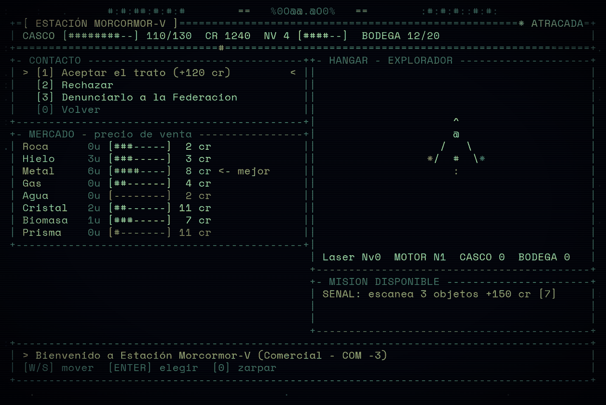<br><sub><b>Contactos</b> — decisiones que cambian la reputación</sub></td>
<td width="50%">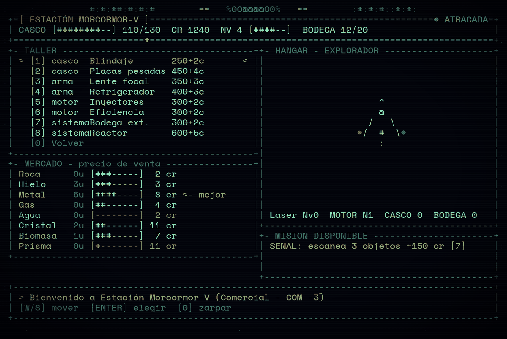<br><sub><b>Taller</b> — piezas por ranura</sub></td>
</tr>
</table>

&nbsp;

## `07 // TU BASE`

Con **500 créditos, 5 de metal y 3 de cristal** puedes fundar una base en el punto donde estés (tecla `B`). Se dibuja como una estación propia y
crece con cada módulo que construyes:

```text
                            BASE
                                 ==
                               =#OO#
                  ====          =##=
                 =#OO#=         |
                  ====- oooo ++ oooo
                      =o     ++     ==     ==
#:#:##:#:#:#         ==    %0000%    ==  =#OO#  :#:#:#::#:#:
#:#:##:#:#:#        o=   %0OOOOOO0%   oo  =##=  :#:#:#::#:#:
#:#:##:#:#:#========oo+++%0O@@@@O0%+++oo========:#:#:#::#:#:
:#:#::#:#:#:  =##=  oo   %0OOOOOO0%   =o        #:#:#:##:#:#
:#:#::#:#:#:  #OO#=  ==    %0000%    ==         #:#:#:##:#:#
               ==     ==     ++     o=
                        oooo ++ oooo -====
                           |         =#OO#=
                        =##=          ====
                        #OO#=
                         ==
```

Los módulos producen recursos por minuto, amplían el almacén o generan **puntos de investigación (RP)**:

| Módulo | Efecto | Coste | Máx. |
|---|---|---|---|
| **Extractor** | produce Roca 3/min, Metal 1.5/min | 150 cr + 2 Metal | 4 |
| **Invernadero** | produce Biomasa 2/min | 200 cr + 2 Agua | 3 |
| **Condensador** | produce Agua 3/min, Gas 1/min | 180 cr + 2 Hielo | 3 |
| **Almacén** | almacena +40 | 120 cr + 3 Metal | 4 |
| **Laboratorio** | genera 2 RP | 300 cr + 2 Cristal | 2 |

Con RP investigas tecnología, y algunas dependen de otras:

| Tecnología | Efecto | Coste | Requiere |
|---|---|---|---|
| **Eficiencia** | +25% producción | 12 RP | — |
| **Estiba** | +50% capacidad | 20 RP | — |
| **Ingeniería** | -20% coste modulos | 30 RP | Eficiencia |
| **Cómputo** | +30% investigación | 45 RP | Ingeniería |

Al acoplarte a tu base se abre su menú: el interior con cada módulo dibujado en su ranura, la lista de módulos con su coste, y un resumen de producción.

```text
                #:#:##:#:#:# =#*##  oo   %0O@@.@O0%   oo  ##*#= :#:#:#::#:#:
  SPACE         #:#:##:#:#:#        oo    00OOOO00    ==        :#:#:#::#:#:
  prototipo 0.3 archivo              ==    %%%%%%    ==
                                      ==o    ++    oo=
                 +-[ BASE PROPIA ]----------------------------------------+
                 | CR 5500  BOD 40/20  ALM 48/150  RP 60                  |
                 +--------------------------------------------------------+
                 +- INTERIOR ---------------------------------------------+
                 | ESCLUSA   Extracto Invernad Condensa Almacen           |
                 | +-----+   [=====]  [=====]  [=====]  [=][=]            |
                 | | [@] |    R  R     B  B     A  A    [=][=]            |
                 | +-----+   [=====]  [=====]  [=====]  [=][=]            |
                 |           x2/4     x1/3     x2/3     x1/4              |
                 |             @                                          |
                 | ====================================================== |
                 +--------------------------------------------------------+
                 +- MODULOS ----------------------------------------------+
                 | > [1] Extractor   2/4  120cr 2Met                    < |
                 |   [2] Invernadero 1/3  160cr 2Agu                      |             +++-
                 |   [3] Condensador 2/3  144cr 2Hie                      |          ++***=-
                 |   [4] Almacen     1/4  96cr 3Met                       |         +*=--==-
                 |   [5] Laboratorio 2/2  240cr 2Cri                      |         *=--+=--
                 |   [0] Volver                                           |         =---==-:
                 +--------------------------------------------------------+          ::::-::
                 +--------------------------------------------------------+            .....
                 | > Base propia. Prod/min: Roca 7.5  Metal 3.8  Biomasa  |
                 | Prod/min: Roca 7.5  Metal 3.8  Biomasa 2.5  Agua 7.5   |
                 +--------------------------------------------------------+
```

Y así se ve desde fuera, con un módulo por cada uno que has construido (aquí con el zoom alejado):

```text
                                        ###   oo====   ###
  SPACE                                    ==        oo         +- RADAR 1:70 ------------+
  prototipo 0.3 archivo    :#:##:#:#      =    %00%    =      :#| .. . .    . .  .   .    |
                           :#:##:#:# ##=  o  %.O@@O0%  =  =## :#|.  .  O. .  .      .. ...|
                           :#:##:#:# ###  o  %0O@@O0%  o  ### :#|.  ..       .  ..  ..o...|
                           #:#::#:#:      =   .0000%   =      #:|..    ?  ....... .  ...  |
                                           oo        ==         | . . .....o.^..     o. .o|
                                        =#=  oo===ooo  =#=      |..  ....... @.. .  . .  .|
                                        ###   :        ###      |      .      O      o    |
                                               =**=             |     ..  .       ?..  . .|
                                                ==              |.  ...... o  . . . ......|
                                                                |   ..... .   .. .  ......|
                                                                | .   .     .....       ..|
                                                                +- [R] escala ------------+
                                              ^
                                              #
                                             /@\                          Asteroide JB-755
                                           *  =  *                        [E] escanear  43u
                                                                               **+==.
                                                                              +-=+==-.
                                                                           [  =-+-=-:.. ]
                                                                              ::--:....
  CASCO [############--] 111/130                                                .....
  NV 4  XP 148/240  CR 5500
  BODEGA 40/20  COMP 3
  COMBUSTIBLE [########--] 78
  BASE 30u  ALM 48/150
  VEL    0 km/s [--------------]
  RUMBO 000  ASISTENCIA ON
  POS +2496,-2470  SECTOR 5:-5 [DENSO]
  ZONA cerca de Tosox-VI
  CATALOGO 20
```

<table>
<tr>
<td width="50%">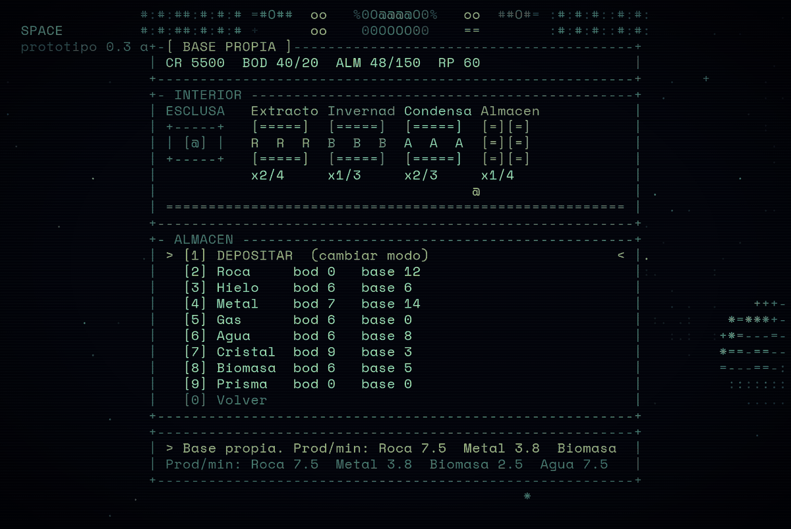<br><sub><b>Almacén</b> — deposita y retira mercancías</sub></td>
<td width="50%">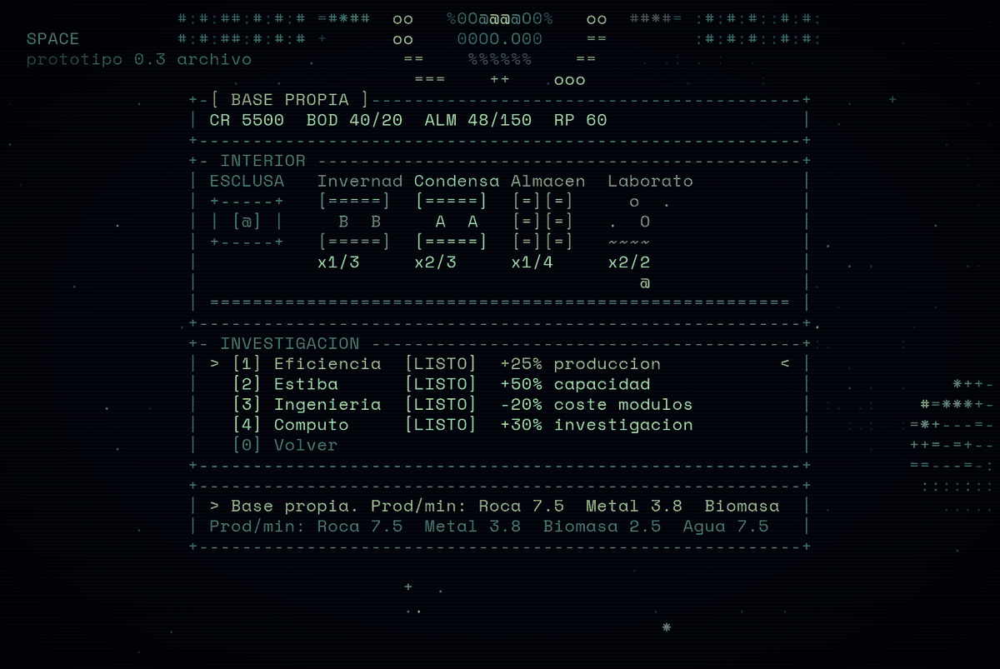<br><sub><b>Investigación</b> — gasta RP en tecnología</sub></td>
</tr>
</table>

&nbsp;

## `08 // EL ARCHIVO: MAPA, CATÁLOGO, DIARIO`

Tres pestañas en una misma pantalla (`M`, `C` y `J`). El juego se **pausa** mientras la tienes abierta.

**Mapa** — los sectores que has visitado se revelan; los vecinos aparecen como `?`. Cada casilla muestra los objetos (`?` sin escanear, `O`/`o`
planeta, `#` estación, `X` ruinas, `!` señal) y la densidad de asteroides (`.:.:`). Debajo, la ficha del sector bajo el cursor:

```text
==[ SPACE // ARCHIVO ]==========================================================[X] cerrar==
  [ 1 MAPA ]   2 CATALOGO     3 BITACORA
============================================================================================
     +        +-3:-2   +-2:-2   +-1:-2   +0:-2    +1:-2    +2:-2    +3:-2    +
         ?     ?        ?        )        ??                ??       ?           ?
               .:.:     .:       .        .:       .:.:.:   .:.:.:   .:.:

     +        +-3:-1   +-2:-1   +-1:-1   +0:-1    +1:-1    +2:-1    +3:-1    +
         ?     #        ?                 |                          ?!          ?
               .:.:.:   .:.:     .:       .:.:     .:.:     .:       .:.:

     +        +-3:0    +-2:0    +-1:0    +0:0   @ +1:0     +2:0     +3:0     +4:0
         ?     ?#       ??       o       [O?#o?oo]                   ?           !
               .:.:     .:.:.:   .:.:.:   .:       .:.:.:   .:.:.:   .

     +        +-3:1    +-2:1    +-1:1    +0:1     +1:1     +2:1     +3:1     +
         ?     ?        |                 O?                ??                   ?
               .:.:     .:.:.:   .:.:     .:.:.:   .:       .:.:.:   .:.:.:

     +        +-3:2    +-2:2    +-1:2    +0:2     +1:2     +2:2     +3:2     +
         ?              ??       ?        ?:       ?        ?        ?#          ?
               .:.:.:   .:.:.:   .:.:.:   .:       .:.:.:   .:       .:.:.:

  +- SECTOR 0:0 -------------------------------------------------------------------------+
  | Estado SECTOR ACTUAL Distancia 0 sectores                                            |
  | Densidad DENSO Planetas 6 Estaciones 1 Asteroides 17 Señales 0                       |
  | Escaneado 5/7 objetos (sin contar asteroides)                                        |
  | @ nave [ ] cursor O o planeta # estacion ? sin escanear ! senal X ruinas * mision    |
  +--------------------------------------------------------------------------------------+
--------------------------------------------------------------------------------------------
  [flechas] mover cursor  [espacio] centrar en tu nave  [TAB] pestana  [ESC] cerrar
```

**Catálogo** — todo lo que has escaneado, con filtros y una ficha por objeto. Con `ENTER` marcas un **rumbo** hacia él: aparece una flecha
en pantalla con su nombre y su distancia.

```text
==[ SPACE // ARCHIVO ]==========================================================[X] cerrar==
    1 MAPA   [ 2 CATALOGO ]   3 BITACORA
============================================================================================
  DESCUBIERTO  planetas 6  estaciones 1  asteroides 2  señales 11  sectores 49
   TODO 20  [PLANETAS 6]  ESTACIONES 1   ASTEROIDES 2   SEÑALES 11

  +- REGISTROS 1/6 ---------------------+ +- DETALLE ------------------------------------+
  | > 020 Kapha-V                PLA    | | Kapha-V                                      |
  |   019 Dralor-VIII            PLA    | | Mundo oceánico                               |
  |   007 Quilul-VII             PLA    | |                                              |
  |   006 Ionka-VIII             PLA    | | Sector     -1:0                              |
  |   004 Moroxtha-VIII          PLA    | | Estado     Escaneado                         |
  |   001 Draarizen-I            PLA    | | Radio      2071 km                           |
  |                                     | | Gravedad   0.70 g                            |
  |                                     | | Temp.      +29 °C                            |
  |                                     | | Atmósfera  Presente                          |
  |                                     | | Anillos    No                                |
  |                                     | |                                              |
  |                                     | | RECURSOS                                     |
  |                                     | | Agua     [#######---]                        |
  |                                     | | Roca     [###-------]                        |
  |                                     | | Cristal  [###-------]                        |
  |                                     | |                                              |
  |                                     | | Archipiélagos y tormentas del tamaño de      |
  |                                     | | continentes.                                 |
  |                                     | |                                              |
  |                                     | | Distancia 867 u   Direccion O   Sector -1:0  |
  |                                     | | [ MARCAR RUMBO ]  (ENTER)                    |
  +-------------------------------------+ +----------------------------------------------+
--------------------------------------------------------------------------------------------
  [W/S] elegir  [A/D] filtrar  [ENTER] rumbo  [TAB] pestana  [ESC] cerrar
```

Las señales también tienen ficha. Las anomalías incluyen su propio dibujo:

```text
==[ SPACE // ARCHIVO ]==========================================================[X] cerrar==
    1 MAPA   [ 2 CATALOGO ]   3 BITACORA
============================================================================================
  DESCUBIERTO  planetas 6  estaciones 1  asteroides 2  señales 11  sectores 49
   TODO 20   PLANETAS 6   ESTACIONES 1   ASTEROIDES 2  [SEÑALES 11]

  +- REGISTROS 1/11 --------------------+ +- DETALLE ------------------------------------+
  | > 018 Nave abandonada RM-3   SEÑ    | | Nave abandonada RM-309                       |
  |   017 Baliza EJ-782          SEÑ    | | Nave abandonada                              |
  |   016 Estación destruida M   SEÑ    | |                                              |
  |   015 Eco sin origen FP-65   SEÑ    | | Sector     3:2                               |
  |   014 Campo de restos NM-6   SEÑ    | | Resultado  Recuperaste 4 lotes de carga.     |
  |   013 Monolito AF-434        SEÑ    | |                                              |
  |   012 Nave abandonada CU-2   SEÑ    | | Sin tripulación, sin alarma, con la bodega a |
  |   011 Senal desconocida MI   SEÑ    | | medio abrir.                                 |
  |   010 Monolito AV-954        SEÑ    | |                                              |
  |   009 Nave abandonada DQ-9   SEÑ    | |                                              |
  |   008 Nave abandonada IA-6   SEÑ    | |                                              |
  |                                     | |                                              |
  |                                     | |                                              |
  |                                     | |                                              |
  |                                     | |                                              |
  |                                     | |                                              |
  |                                     | |                                              |
  |                                     | |                                              |
  |                                     | |                                              |
  |                                     | | Distancia 1623 u   Direccion SE   Sector 3:2 |
  |                                     | | [ MARCAR RUMBO ]  (ENTER)                    |
  +-------------------------------------+ +----------------------------------------------+
--------------------------------------------------------------------------------------------
  [W/S] elegir  [A/D] filtrar  [ENTER] rumbo  [TAB] pestana  [ESC] cerrar
```

<table>
<tr>
<td width="50%">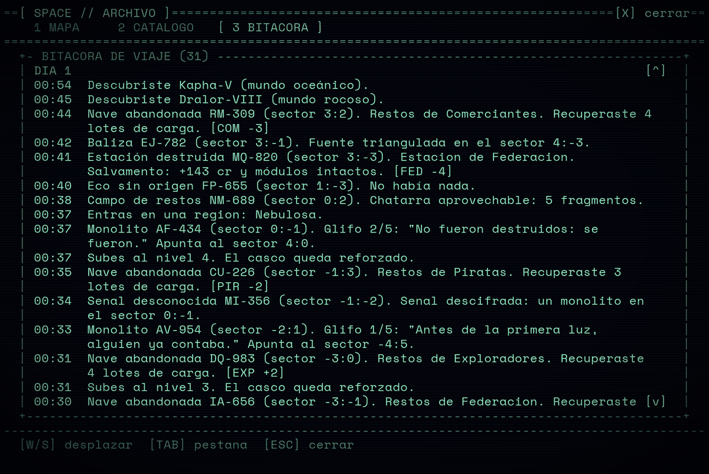<br><sub><b>Bitácora</b> — un diario que se escribe solo</sub></td>
<td width="50%">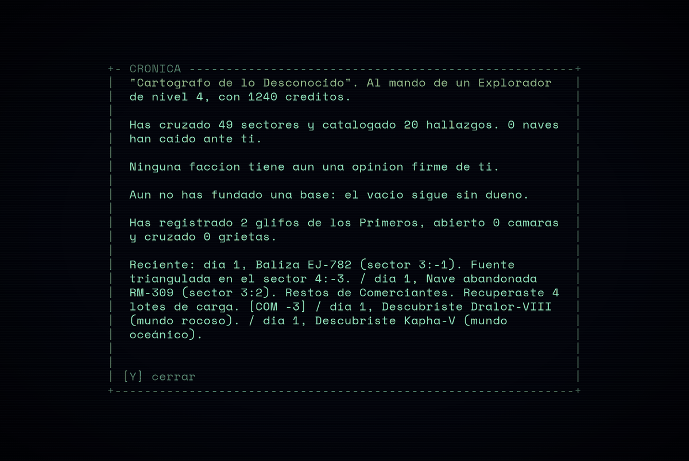<br><sub><b>Crónica</b> (<code>Y</code>) — tu historia hasta ahora</sub></td>
</tr>
<tr>
<td width="50%">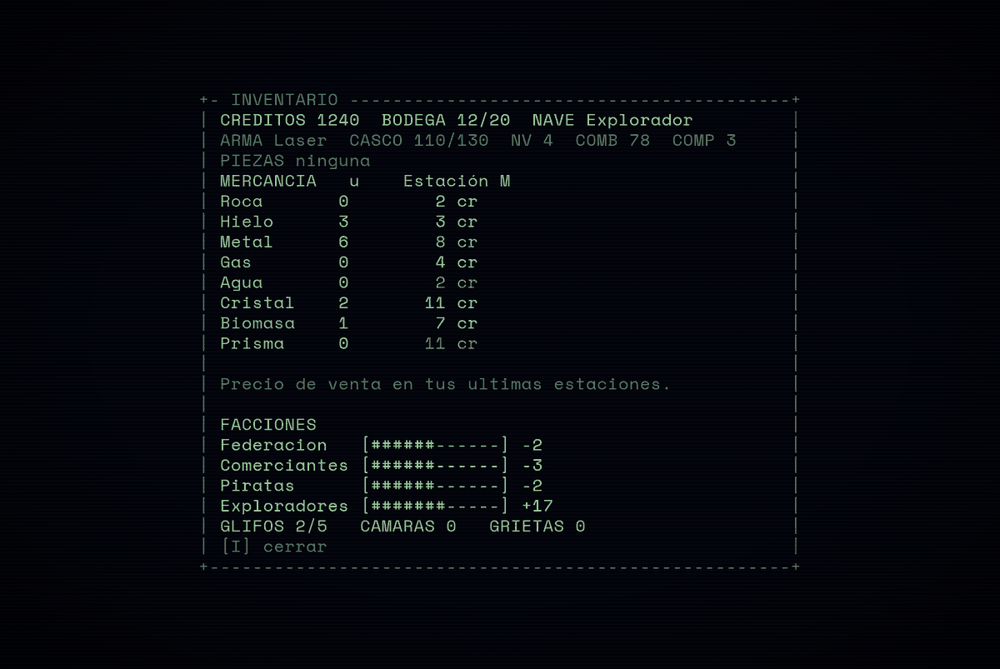<br><sub><b>Inventario</b> (<code>I</code>) — carga, facciones, glifos</sub></td>
<td width="50%">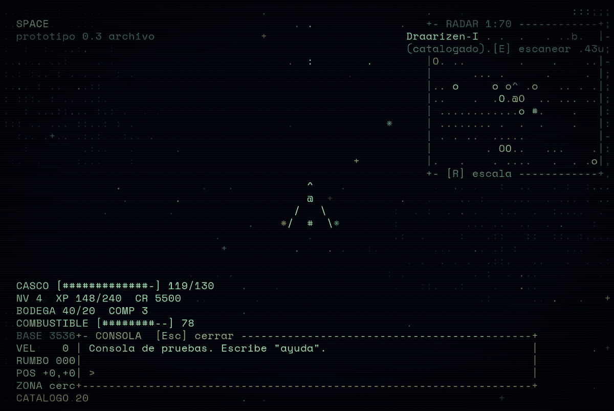<br><sub><b>Consola de pruebas</b> (<code>`</code> o <code>F2</code>)</sub></td>
</tr>
</table>

La **consola de pruebas** acepta comandos para probar el juego: dar dinero o bienes, ajustar reputación, subir de nivel, crear la base y sus módulos.
Escribe `ayuda` para verlos todos.

&nbsp;

## `09 // MISIONES Y REPUTACIÓN`

Cada estación ofrece una misión a la vez. Hay cinco tipos:

```text
  kill     ▸ destruir N piratas
  scan     ▸ escanear N objetos
  boss     ▸ cazar al pirata jefe
  explore  ▸ llegar a una zona a cierta distancia y rumbo
  deliver  ▸ entregar N unidades de una mercancía a la estación
```

La primera misión es especial y arranca una pequeña historia. *(Diagrama hecho a mano; contiene el final.)*

```text
  ┌────────────────────┐     ┌────────────────────┐     ┌────────────────────────┐
  │ Estación Morcormor │     │ SEÑAL: escanea 3   │     │ Señal triangulada:     │
  │ te ofrece la misión│ ──▶ │ objetos (+150 cr)  │ ──▶ │ viaja al sector 4:-3   │
  └────────────────────┘     └────────────────────┘     └───────────┬────────────┘
                                                                    │
  ┌────────────────────────┐     ┌────────────────────┐     ┌───────▼────────────┐
  │ Vuelve a Estación Ecos │     │ Derrota al jefe    │     │ Estación Ecos:     │
  │ +500 cr y un Caza      │ ◀── │ pirata (+300 cr)   │ ◀── │ "los piratas nos   │
  └────────────────────────┘     └────────────────────┘     │ tomaron..."        │
                                                            └────────────────────┘
```

Tu reputación con cada facción va de `-100` a `+100` y se ve en el inventario. Destruir piratas la sube con la Federación y los Comerciantes y la baja con los Piratas.
Si te vuelves muy hostil para una facción, sus estaciones pueden negarte el acceso.

&nbsp;

## `10 // CONTROLES`

```text
┌──────────────────────────────────────────────────────────────────────┐
│  NAVEGACIÓN                                                          │
│    W / ↑            impulso                                          │
│    A D / ← →        girar                                            │
│    S / Espacio      freno                                            │
│    SHIFT            turbo (con impulso)                              │
│    Z                asistencia de vuelo (activar / desactivar)       │
│                                                                      │
│  ACCIÓN                                                              │
│    E  (mantener)    escanear                                         │
│    F                disparar / minar                                 │
│    Q                cambiar de arma                                  │
│    G                atracar en una estación                          │
│    L                aterrizar / despegar                             │
│    B                construir tu base                                │
│                                                                      │
│  PANTALLAS                                                           │
│    M  C  J          mapa · catálogo · bitácora                       │
│    I                inventario                                       │
│    Y                crónica                                          │
│    O  + -           tamaño de los símbolos (zoom)                    │
│    R                escala del radar                                 │
│    H                mostrar / ocultar la ayuda                       │
│    `  o  F2         consola de pruebas                               │
└──────────────────────────────────────────────────────────────────────┘
```

En móvil el juego muestra una botonera táctil con las mismas acciones.

&nbsp;

## `11 // PROGRESIÓN`

Empiezas con una nave **Explorador**, un **Láser**, 100 de casco, bodega de 20, 100 de combustible y 50 créditos.
Cada acción da experiencia; al subir de nivel el casco se refuerza. Todo se guarda automáticamente en el navegador (`localStorage`).

```text
  QUÉ HACES                                           QUÉ OBTIENES
  ─────────                                           ────────────
  escanear un objeto nuevo        ─────────────────▶  XP y créditos (señales: su propio botín)
  destruir un enemigo             ─────────────────▶  XP, créditos y reputación
  completar una misión            ─────────────────▶  créditos y XP
  vender mercancía                ─────────────────▶  créditos y un poco de reputación
  subir de nivel                  ─────────────────▶  más casco máximo
```

&nbsp;

## `12 // EJECUTAR Y ESTRUCTURA`

**Jugar:** abre `index.html` con doble clic. No necesita servidor ni instalación.
**Compartir:** `python3 tools/build.py` genera `dist/Space.html`, un único archivo con todo dentro.

```text
Space/
├── index.html            marcado + lista ordenada de scripts
├── css/style.css
├── js/
│   ├── core/             base, estado y orquestación del fotograma
│   ├── data/             contenido: planetas, naves, economía, regiones, módulos...
│   ├── universe/         generación determinista del universo
│   ├── player/           estado, nave, inventario y reputación del jugador
│   ├── entities/         enemigos y estaciones
│   ├── systems/          reglas: vuelo, combate, escaneo, economía, base, regiones...
│   ├── rendering/        dibujo ASCII: planetas, naves, estaciones, HUD
│   └── ui/               pantallas: muelle, base, archivo, consola, entrada
├── tools/                construir el bundle, tests y análisis
├── docs/                 arquitectura y capturas
└── dist/Space.html       versión de un solo archivo
```

La documentación técnica —cómo fluye un fotograma, quién es dueño de cada estado, qué archivos tocar para añadir un enemigo, un módulo o un
arma, y cómo se prueba— está en **[`docs/ARQUITECTURA.md`](docs/ARQUITECTURA.md)**.

&nbsp;

## `13 // FILOSOFÍA VISUAL`

```text
  ┌───────────────────────────────────────────────────────────────┐
  │                                                               │
  │   NO SE DIBUJA CON IMÁGENES. SE DIBUJA CON TEXTO.             │
  │                                                               │
  │   Un planeta es una rampa de caracteres:    .:-=+*#%@         │
  │   Una nave es una silueta de pocos glifos:    ^  @  /#\       │
  │   El vacío no está vacío: está hecho de       .  :  +  *      │
  │                                                               │
  │   La interfaz habla como una terminal: pocas palabras,        │
  │   barras de caracteres, marcos de + - |.                      │
  │                                                               │
  └───────────────────────────────────────────────────────────────┘
```

La luz es parte del dibujo: cada planeta tiene un lado iluminado y un terminador, y la rampa de caracteres va de lo más tenue (`.`) a lo más
brillante (`@`). Con los símbolos pequeños (tecla `O`, `+` y `-`), el motor dibuja el mundo en una capa de mayor resolución y deja la interfaz nítida encima.

&nbsp;

## `14 // ESTADO ACTUAL`

```text
  UNIVERSO PROCEDURAL                    [██████████████████] 100%
  PLANETAS, ESTACIONES, ASTEROIDES       [██████████████████] 100%
  FÍSICA DE LA NAVE, RADAR, ESCANEO      [██████████████████] 100%
  COMBATE, ENEMIGOS, JEFE                [██████████████████] 100%
  ECONOMÍA, MERCADOS, REPUTACIÓN         [██████████████████] 100%
  ATERRIZAJE Y MINERÍA EN SUPERFICIE     [██████████████████] 100%
  SEÑALES, MISTERIOS Y REGIONES          [██████████████████] 100%
  ARCHIVO: MAPA, CATÁLOGO, BITÁCORA      [██████████████████] 100%
  BASE PROPIA, MÓDULOS, TECNOLOGÍA       [██████████████████] 100%
  CONTACTOS, TALLER DE PIEZAS            [██████████████████] 100%
  ──────────────────────────────────────────────────────────────
  TERMINAL DEL JUEGO (UI)                [░░░░░░░░░░░░░░░░░░]   0%
  MÓDULOS ES + ESTADO EXPLÍCITO          [░░░░░░░░░░░░░░░░░░]   0%
```

&nbsp;

<div align="center">

```text
╔════════════════════════════════════════════════════╗
║                                                    ║
║              FIN DE LA TRANSMISIÓN                 ║
║                                                    ║
║         el vacío te espera, piloto  _  _  _        ║
║                                                    ║
╚════════════════════════════════════════════════════╝
```

</div>
